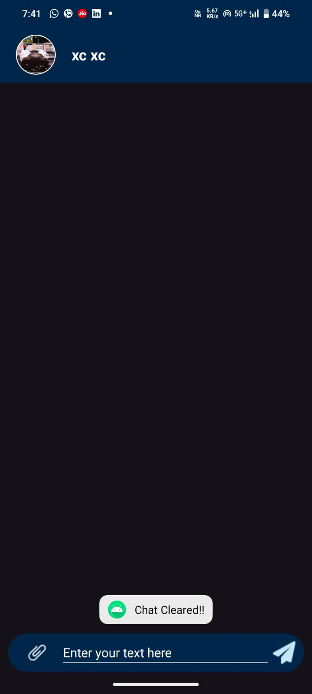
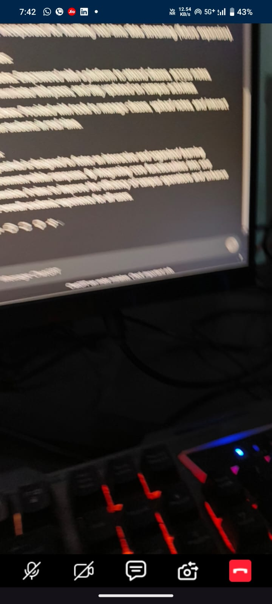
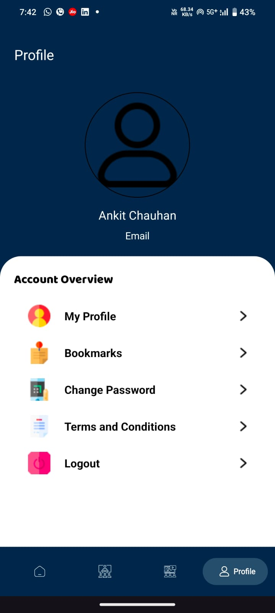
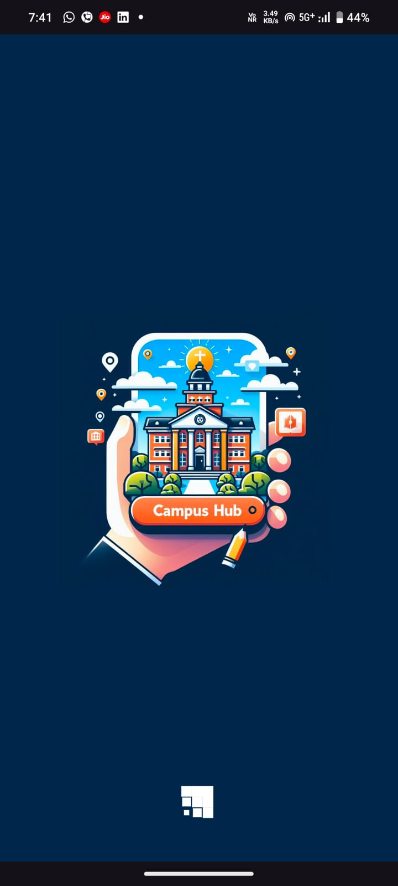

# CampusHub

CampusHub is a comprehensive campus management application designed to streamline the learning process for both teachers and students. With all essential campus facilities integrated into a single application, CampusHub provides a seamless experience for managing campus activities, from live classes to sharing notes and managing events.

## Key Features

- 🎥 **Live Interactive Classes**: Engage in high-quality live classes with real-time interaction.
- 💬 **Real-Time Chat**: Stay connected with peers and teachers through real-time chat.
- 📚 **Notes Sharing**: Easily share and access notes with Google Drive integration.
- 📝 **Notices and Bulletins**: Stay informed with the latest campus updates and notices.
- 🎓 **Tutorials and Learning Materials**: Access a wide range of learning materials and tutorials.
- 📅 **Event Management**: Manage and participate in campus events efficiently.

## Technologies Used

- **Agora Live Broadcasting SDK** (Based on WebRTC): For seamless and high-quality live classes.
- **Firebase**: For authentication, real-time databases, and storage of user data and chat messages.
- **Google Drive API**: Integrated for large file storage and seamless access to shared notes and materials.
- **Lottie Animations**: Enhanced user experience with engaging animations in UI components.

## Screenshots

  <table>
    <tr>
      <td></td>
      <td></td>
    </tr>
    <tr>
      <td></td>
      <td></td>
    </tr>
  </table>

